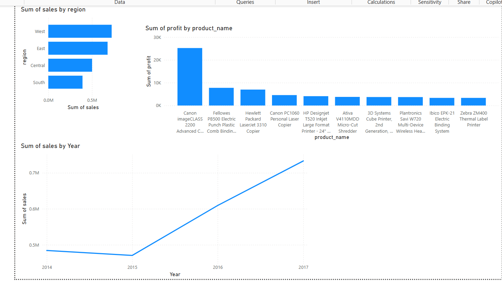

# 🛍️ Sales Analytics Data Pipeline

## 📌 Overview
This project demonstrates an end-to-end data pipeline built using Python and Power BI. It simulates how raw sales data is ingested, cleaned, stored, and visualized to extract actionable business insights.

## 🧰 Tools & Technologies
- **Python** (Pandas, OS)
- **Power BI Desktop**
- **Git & GitHub**

## 🛠️ Features
- Ingest raw sales data (`SampleSuperstore.csv`)
- Clean and standardize column names
- Remove missing values
- Save cleaned data to structured folders
- Build dashboards for:
  - Regional sales performance
  - Top products by profit
  - Monthly sales trends

## 📂 Project Structure
```
sales-analytics-pipeline/
│
├── ingest_data.py                   # Python script to clean data
├── data/
│   ├── raw/                         # Raw input data
│   │   └── SampleSuperstore.csv
│   └── processed/                   # Cleaned output data
│       ├── cleaned_superstore.csv
│       └── Sales Dashboard in PowerBI.pbix
```

## 📊 Dashboard
The Power BI report (`Sales Dashboard in PowerBI.pbix`) includes:
- Sales by region
- Top 10 products by profit
- Monthly sales trend



## 🚀 Getting Started
1. Clone this repo
2. Run `ingest_data.py` to clean the data
3. Open Power BI and load the cleaned CSV for dashboarding

## 🙋‍♀️ Author
**Sri Lakshmi Guduru**

Feel free to connect on [LinkedIn](https://www.linkedin.com/in/guduru-sri-lakshmi)

---

📌 *This project showcases a foundational data pipeline and serves as a base for future enhancements using DBT, Airflow, or cloud services.*
